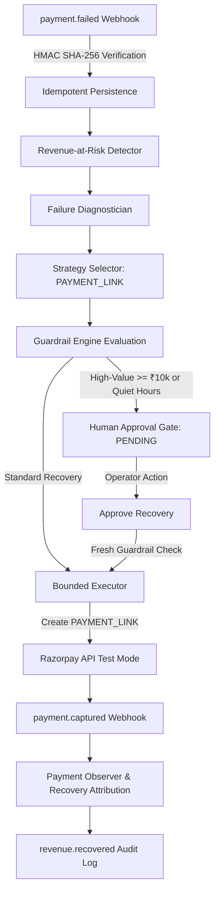

# PayFlow (Vasuli AI) — Revenue Recovery Platform

> **Razorpay Buildathon 2026 — Track 3: AI Revenue Recovery**  
> *Production-hardened, deterministic revenue recovery engine & institutional financial operations console.*

[](https://github.com/zainraza-786/payflow)
[](https://github.com/zainraza-786/payflow)
[](https://github.com/zainraza-786/payflow)
[](https://vasuli-ai.vercel.app)
[](https://vasuli-backend.onrender.com)

---

## Live Deployments

- **Hosted Frontend (Vercel)**: [https://vasuli-ai.vercel.app](https://vasuli-ai.vercel.app)
- **Hosted Backend API (Render)**: [https://vasuli-backend.onrender.com](https://vasuli-backend.onrender.com)
- **GitHub Repository**: [https://github.com/zainraza-786/payflow](https://github.com/zainraza-786/payflow)

---

## Executive Overview

**PayFlow (Vasuli AI)** is an institutional-grade revenue recovery platform designed to observe failed payment transactions, diagnose failure root causes, evaluate safety policies, require human authorization for high-value recoveries, and execute bounded recovery attempts via Razorpay.

Unlike un-gated AI systems that risk customer friction or duplicate charges, PayFlow enforces **deterministic safety guardrails** and a **fail-closed Human Approval Gate**.

### Recovery Pipeline Flow



---

## Key Features

1. **Deterministic Guardrail Engine**:
   - **Quiet Hours Enforcement**: Blocks automated recovery execution between 22:00 and 08:00 IST.
   - **Attempt Limits**: Restricts recovery execution to a maximum of 2 attempts per transaction.
   - **High-Value Threshold**: Forces human approval for any transaction $\ge$ ₹10,000 INR.

2. **Human Approval Authorization Gate**:
   - Suspends high-risk or high-value recovery execution in `PENDING` status.
   - Requires explicit operator authorization (`Approve Recovery` / `Reject`).
   - Re-evaluates `RecoveryGuardrailEngine` immediately prior to execution (`Execute Recovery`).

3. **Institutional Precision Light Interface**:
   - Designed following high-density financial software aesthetics (Stight / Mercury inspired).
   - Visual connected 8-stage lifecycle stepper timeline.
   - Real-time audit telemetry stream and tabular monospaced currency formatting (`font-mono`).
   - Interactive 1-click Webhook Simulator powered by Web Crypto API HMAC-SHA256 signing.

4. **Cryptographic Integrity & Fail-Closed Boundaries**:
   - Verified Razorpay HMAC-SHA256 signature verification (`POST /webhooks/razorpay`).
   - Zero live credentials required. Zero un-gated autonomous execution.

---

## Technology Stack

- **Backend**: Python 3.10+, FastAPI, SQLAlchemy ORM, Pydantic v2, Pytest (150 test suites).
- **Frontend**: React 18, Vite, Tailwind CSS, Lucide Icons, Web Crypto API.
- **Database**: SQLite / PostgreSQL with strict `Decimal` monetary precision and explicit UTC audit timestamps.
- **Hosting**: Vercel (Frontend SPA) + Render (FastAPI Web Service).

---

## Local Setup & Quick Start

### 1. Backend Setup

```bash
cd backend
python -m venv venv
# On Windows: venv\Scripts\activate
# On Linux/macOS: source venv/bin/activate

pip install -r requirements.txt
cp .env.example .env

# Run FastAPI backend
python -m uvicorn app.main:app --host 127.0.0.1 --port 8000
```

### 2. Frontend Setup

```bash
cd frontend
npm install

# Run Vite development server
npm run dev
```

Open [http://localhost:3000](http://localhost:3000) in your browser.

---

## Automated Verification

### Run Backend Unit & Integration Tests (150 Passed)

```bash
cd backend
venv/Scripts/pytest -q
```

### Run Bytecode Compilation Check

```bash
cd backend
python -m compileall app tests
```

### Run Frontend Production Build

```bash
cd frontend
npm run build
```

---

## Backend API Specification

| Method | Endpoint | Description |
| :--- | :--- | :--- |
| `GET` | `/health` | System health check & connectivity status |
| `POST` | `/webhooks/razorpay` | Razorpay HMAC-signed webhook event ingestion |
| `POST` | `/recovery/workflow/{payment_id}` | Trigger deterministic workflow assessment |
| `POST` | `/recovery/approval/{payment_id}` | Request Human Approval Gate authorization |
| `POST` | `/recovery/approval/{approval_id}/approve` | Approve pending authorization request |
| `POST` | `/recovery/approval/{approval_id}/reject` | Reject pending authorization request |
| `POST` | `/recovery/approval/{approval_id}/execute` | Execute approved recovery after fresh guardrail check |

---

## Security & Compliance Invariants

- **Secrets Protection**: Secrets (`RAZORPAY_KEY_SECRET`, `RAZORPAY_WEBHOOK_SECRET`) are stored exclusively server-side in `.env` (protected by `.gitignore`).
- **TEST MODE Safety**: Operating strictly under Razorpay TEST MODE (`rzp_test_...`). Zero real-money transactions or live credentials used.
- **Fail-Closed Design**: An `APPROVED` status alone never overrides guardrail policies. Re-evaluation is forced prior to execution.

---

## Repository Structure

```
payflow/
├── backend/
│   ├── app/
│   │   ├── api/routes/       # REST API endpoints (health, webhooks, recovery, approval)
│   │   ├── models/           # SQLAlchemy models (Payment, RecoveryAttempt, AuditLog, Approval)
│   │   ├── schemas/          # Pydantic data validation schemas
│   │   ├── services/agent/   # Detector, Diagnostician, Strategy, Guardrails, Executor, Observer
│   │   └── services/razorpay/ # Razorpay API Client & Webhook Signature Verification
│   ├── tests/                # 150 Pytest unit & integration test suites
│   ├── requirements.txt      # Python dependencies
│   └── README.md
├── frontend/
│   ├── src/
│   │   ├── components/       # Stitch UI components (Overview, PaymentsTable, PaymentDetail, ApprovalsView, AuditTrail, Settings, Simulator)
│   │   ├── services/         # API service & browser HMAC-SHA256 signer
│   │   └── types/            # TypeScript interfaces
│   ├── package.json
│   └── README.md
├── .gitignore                # Protects secrets, databases, node_modules, build outputs
└── README.md                 # Project root documentation
```

---

## License

Developed for **Razorpay Buildathon 2026**. All rights reserved.
